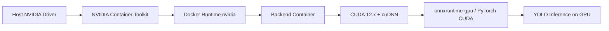

# Enable NVIDIA GPU (CUDA) Inference in Docker

The backend container currently runs YOLO/ONNX inference on CPU (`onnxruntime` + `torch+cpu`). This plan migrates the inference pipeline to use NVIDIA GPU via CUDA inside Docker for significantly better performance and lower CPU load.

## Architecture Overview



## User Review Required

> [!IMPORTANT]
> **Host machine prerequisites** — The machine running Docker must have:
> 1. A physical NVIDIA GPU (e.g. GTX 1650, RTX 3060, etc.)
> 2. NVIDIA GPU drivers installed (version ≥ 525 recommended)
> 3. **NVIDIA Container Toolkit** installed ([install guide](https://docs.nvidia.com/datacenter/cloud-native/container-toolkit/latest/install-guide.html))
>
> Without these, the GPU will not be visible inside Docker containers.

> [!WARNING]
> **Docker image size increase** — The CUDA base image is ~3-5 GB vs ~150 MB for `python:3.11-slim`. The final backend image will be significantly larger. This is unavoidable for GPU support.

> [!WARNING]
> **CPU fallback** — The changes include automatic fallback to CPU if no GPU is detected, so the same image works on machines without NVIDIA GPUs (just slower).

## Open Questions

1. **Which NVIDIA GPU do you have?** This determines the optimal CUDA version. CUDA 12.x works for most modern cards (GTX 10xx+). Older cards may need CUDA 11.8.
2. **Do you want a separate `docker-compose.gpu.yml` override file**, or should we modify the main `docker-compose.yml` directly? A separate override keeps the default CPU-compatible and lets you opt-in with `docker compose -f docker-compose.yml -f docker-compose.gpu.yml up`.
3. **Do you already have NVIDIA Container Toolkit installed?** If not, I can provide the installation commands for your OS.

## Proposed Changes

### Host Setup (Manual — Not Code Changes)

Install NVIDIA Container Toolkit on the Docker host (one-time setup):

```powershell
# On Windows with Docker Desktop:
# 1. Ensure latest NVIDIA GPU drivers are installed
# 2. Docker Desktop 4.x+ with WSL2 backend automatically supports GPU passthrough
# 3. No separate "nvidia-container-toolkit" install needed on Windows — 
#    Docker Desktop handles it via WSL2 integration
```

For Linux hosts:
```bash
# Add NVIDIA Container Toolkit repo
curl -fsSL https://nvidia.github.io/libnvidia-container/gpgkey | sudo gpg --dearmor -o /usr/share/keyrings/nvidia-container-toolkit-keyring.gpg
curl -s -L https://nvidia.github.io/libnvidia-container/stable/deb/nvidia-container-toolkit.list | \
  sed 's#deb https://#deb [signed-by=/usr/share/keyrings/nvidia-container-toolkit-keyring.gpg] https://#g' | \
  sudo tee /etc/apt/sources.list.d/nvidia-container-toolkit.list
sudo apt-get update && sudo apt-get install -y nvidia-container-toolkit
sudo nvidia-ctk runtime configure --runtime=docker
sudo systemctl restart docker
```

---

### Dockerfile (GPU variant)

#### [NEW] [Dockerfile.gpu](file:///d:/Projects/DoAnDN/backend/Dockerfile.gpu)

A GPU-enabled Dockerfile using NVIDIA's CUDA base image instead of `python:3.11-slim`. Key differences:
- Base image: `nvidia/cuda:12.4.1-cudnn-runtime-ubuntu22.04` (includes CUDA + cuDNN)
- Installs Python 3.11 from deadsnakes PPA
- Replaces `onnxruntime` with `onnxruntime-gpu`
- Replaces `torch+cpu` with CUDA-enabled `torch`

---

### Requirements (GPU variant)

#### [NEW] [requirements.gpu.txt](file:///d:/Projects/DoAnDN/backend/requirements.gpu.txt)

A GPU-specific requirements file that swaps:
```diff
-onnxruntime>=1.16.0
+onnxruntime-gpu>=1.16.0

---extra-index-url https://download.pytorch.org/whl/cpu
-torch==2.1.2+cpu
-torchvision==0.16.2+cpu
+--extra-index-url https://download.pytorch.org/whl/cu124
+torch==2.1.2+cu124
+torchvision==0.16.2+cu124
```

---

### Docker Compose (GPU override)

#### [NEW] [docker-compose.gpu.yml](file:///d:/Projects/DoAnDN/docker-compose.gpu.yml)

An override file that adds GPU resource reservation to the backend service:
```yaml
services:
  backend:
    build:
      dockerfile: Dockerfile.gpu
    deploy:
      resources:
        reservations:
          devices:
            - driver: nvidia
              count: 1
              capabilities: [gpu]
```

Usage: `docker compose -f docker-compose.yml -f docker-compose.gpu.yml up --build`

---

### Inference Service

#### [MODIFY] [yolo_inference.py](file:///d:/Projects/DoAnDN/backend/app/services/yolo_inference.py)

Add GPU device selection so Ultralytics uses CUDA when available:

1. Add a `_detect_device()` class method that checks `torch.cuda.is_available()` and returns `"cuda"` or `"cpu"`
2. Pass `device=self._device` to the YOLO model `__call__()` invocation (line 379-385)
3. Log the selected device at startup for observability

```diff
 def __init__(self):
+    self._device = self._detect_device()
+    logger.info("YOLO inference device: %s", self._device)
     self.models: Dict[str, Dict[str, Any]] = {}
```

```diff
 results = model_entry["model"](
     inference_image,
     conf=conf_threshold,
     imgsz=self.INFERENCE_IMGSZ,
     verbose=False,
     classes=allowed_ids,
+    device=self._device,
 )
```

---

### Environment Configuration

#### [MODIFY] [.env.example](file:///d:/Projects/DoAnDN/.env.example)

Add a `YOLO_DEVICE` env var to allow runtime override:
```
# Inference Device (auto, cpu, cuda, cuda:0, cuda:1)
YOLO_DEVICE=auto
```

---

## File Summary

| File | Action | Purpose |
|------|--------|---------|
| `backend/Dockerfile.gpu` | **NEW** | CUDA-enabled Dockerfile |
| `backend/requirements.gpu.txt` | **NEW** | GPU Python dependencies |
| `docker-compose.gpu.yml` | **NEW** | GPU resource reservation override |
| `backend/app/services/yolo_inference.py` | **MODIFY** | Add CUDA device selection |
| `.env.example` | **MODIFY** | Add `YOLO_DEVICE` config |

## Verification Plan

### Automated Tests
```bash
# 1. Build the GPU image
docker compose -f docker-compose.yml -f docker-compose.gpu.yml build backend

# 2. Verify CUDA is visible inside the container
docker compose -f docker-compose.yml -f docker-compose.gpu.yml run --rm backend python -c "import torch; print(f'CUDA available: {torch.cuda.is_available()}'); print(f'Device: {torch.cuda.get_device_name(0) if torch.cuda.is_available() else \"CPU\"}')"

# 3. Verify onnxruntime-gpu providers
docker compose -f docker-compose.yml -f docker-compose.gpu.yml run --rm backend python -c "import onnxruntime; print(onnxruntime.get_available_providers())"
# Expected: ['TensorrtExecutionProvider', 'CUDAExecutionProvider', 'CPUExecutionProvider']

# 4. Start the full stack and test inference endpoint
docker compose -f docker-compose.yml -f docker-compose.gpu.yml up
# Check backend logs for: "YOLO inference device: cuda"
```

### Manual Verification
- Send a test frame to the inference endpoint and compare latency vs CPU
- Monitor GPU utilization with `nvidia-smi` on the host during inference
